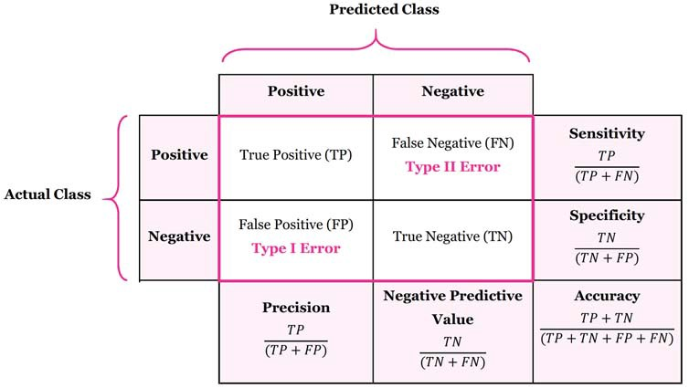

# Tuesday - May 20th

## Daily Overview
- Start Time: 9:10AM
- End Time: 7:47PM

## Today's Priorities
1. Write report with findings and analysis
2. Finish Ruby technical onboarding
3. Prepare to pivot into Shop Bot LLM Judge

## Tasks & Progress
### Completed
- [Internship Logs](https://docs.google.com/document/d/1OP6eWeH_pp2Jss-_1qxGwVFwl2ml43cihyqPkZvf6FU/edit?tab=t.u0of4776rhm3)
- Statistical analysis of LLM Eval
  - Write a 1-page findings doc
  - Look into data on where it disagrees to find insights
    - LLM is harsher than human in labeling fails
  - How do we reconcile good Cohen's Kappa with poor classification metrics?
    - Cohen's Kappa is less meaningful when data is imbalanced

### In Progress
- Read [Replacing Judges with Juries](https://arxiv.org/pdf/2404.18796)
- Technical Onboarding
  - Current status: Ruby (OOP)
- PP session prep
  - Shannon - 05.21

### Inventory
- Create Brag Doc
  - Priority: High
- Review [MLE best practices](https://vault.shopify.io/page/ML-Best-Practices~cGm2.md)
  - Priority: Med
- Review remaining slides for next meeting with Delali
  - Prioriy: Med
- Review [LLM evaluation](https://www.oreilly.com/radar/a-field-guide-to-rapidly-improving-ai-products/) and [RAG](https://aws.amazon.com/what-is/retrieval-augmented-generation/)
  - Prioriy: Low
- Learn about [monorail](https://vault.shopify.io/page/Monorail~1rHm.md)
  - Priority: Low
- Learn about [LLM eval project](https://vault.shopify.io/gsd/proposals/9ETAno) for Q2
  - Priority: Med
- Play with the BigQuery console
  - Priority: Low
- Read through [QAU documentation](https://docs.google.com/document/d/1sfNOpJTmoNoyYs_lIkPMgTLlii61nWy_ygC1sb-_zyU/edit?tab=t.0#heading=h.gdqdy9yvqkj5)
  - Priority: Low
- Read about [PII](https://vault.shopify.io/page/Personally-identifiable-information-PII~4631.md)
  - Priority: Low
- Message for coffee chats: Curtis, Cody, Diego
  - Priority: Low
- Read [autocomplete docs](https://docs.google.com/document/d/1FN84YruPEcKwwMPmkU9P-xOPz7Lgp1BWe2QFdtg7sT0/edit?tab=t.d4w7ie4tl9vq#heading=h.9dxbpvikj18m)
  - Priority: Med
- Read documentation on [major changes](https://docs.google.com/document/d/1WyIaUrdqcneD_kY8aPgpCv-8qtfBg9CSzIr_ka-47b8/edit?tab=t.0#heading=h.8ocwxlp3fls8)
  - Priority: Low
- Reevaluate using request_id and inquiry_type
  - Priority: Med
- Read [A Survey on LLM-as-a-Judge](https://arxiv.org/pdf/2411.15594)
  - Priority: Med
- Set up coffee chat with Topher Bullock to discuss MCP implementation for more agentic support assistants
  - Priority: Low

## Meetings & Discussions
### Daily Standup
- Time: 10:00AM - 10:20AM
- Participants: Calvin
- Key Points:
  - Learn monorail from Shannon (upfunneling monorail events)
    - What data moddeling looks like
  - High precision when a model is judging its own output can induce bias
    - Use different models
    - Juries instead of judges
  - 4.1-mini will have slightly worse performance but will get gain from longer context window and full text
    - Mix data with responses of different models for robustness
    - Opportunity for interesting statistical analysis like stratifying the data by model and observing LLM eval performance
  - LLM judge for Shop Bot is top priority
    - classification - pass/fail
    - labeling done outside
    - Prototype by Friday
    - Pairing tomorrow
- Action Items:
  - [ ] Read [Replacing Judges with Juries](https://arxiv.org/pdf/2404.18796)
  - [ ] Read [A Survey on LLM-as-a-Judge](https://arxiv.org/pdf/2411.15594)
  - [x] Add de-identification process project to interest doc
  - [x] How do we reconcile good Cohen's Kappa with poor classification metrics?
  - [ ] Set up coffee chat with Topher Bullock to discuss MCP implementation for more agentic support assistants
  - [ ] Pivot to implementing LLM evaluator for Shop Bot

### Support Data Team Sync
- Time: 2:30PM - 3:30PM
- Participants: Team
- Key Points:
  - New teammember Fedor

## Technical Notes
- Precision vs Recall

  - Precision is the proportion of correct positive predictions from all positive predictions
    - It is used when we value the model correctly predicting the positive case (minimize false positives)
  - Recall (or Sensitivity) is the proportion of correct positive predictions from all actual positive cases
    - It is used when we value the model not incorreclty predicting the negative case (minimize false negatives)

## Learnings & Insights
- Would synthetic fail response data be a good mitigation to imbalanced datasets?
- Road towards building agentic bots: [Building effective agents](https://www.anthropic.com/engineering/building-effective-agents)
  - Implement [MCP](https://vault.shopify.io/page/Model-Context-Protocol-MCP~QTRT.md)
- We should focus on fail metrics and Macro Avg to mitigate imbalance in data

## Challenges & Solutions
- Tried reorgnizing my directory but notebook will not find venv in parent directory

## Tomorrow's Plan
- Pull samples of Shop bot transcripts from database
- Label samples and evaluate on multiple LLMs (other than OpenAI)